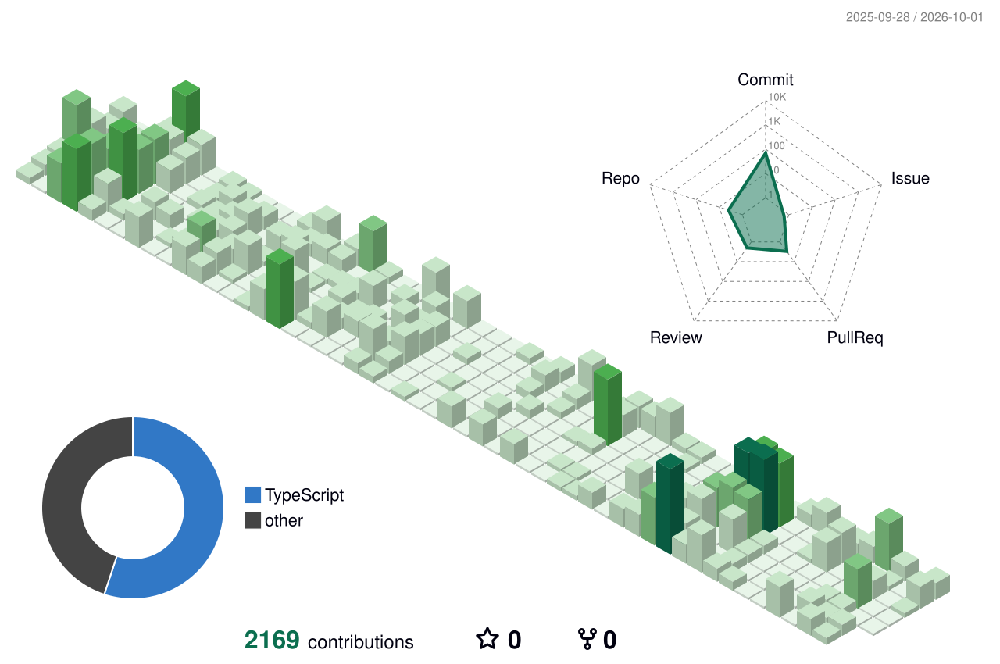
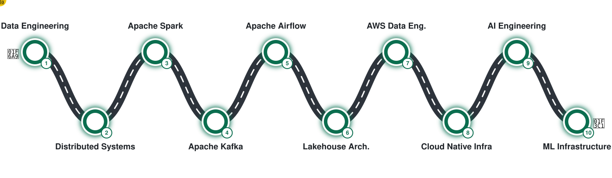

 

 

I'm **Edwin Wachira**, a software and data engineer based in Kenya and the founder of **[Homara](https://homara-ke.homes)**.

I build whole systems: the database schema, the APIs, the data pipelines, the cloud setup and the interface people actually use. Right now that means taking Kenya's property market from WhatsApp groups and spreadsheets to software.

<table>
<tr>
<td width="50%" valign="top">

**🔭 Building**

- **Homara**: renting and property management for Kenya
- **Homara Atlas**: property market analytics and APIs
- **Aviora**: booking and operator tools for private aviation charters in Africa

</td>
<td width="50%" valign="top">

**🌱 Going deeper on**

- Streaming and batch pipelines: Kafka, Spark, Airflow
- Lakehouse architecture on AWS
- LLM systems in production: agents, RAG, evals

</td>
</tr>
</table>

---

## 🏡 Homara

<table>
<tr>
<td>

**Home, made clear.** Homara is how people in Kenya find, rent and manage property. Landlords, tenants, agents and staff each get their own workspace on one platform, with digital agreements, secure sign-in, interactive maps and property analytics.

As founder and CEO, I lead product strategy, engineering and system architecture.

Next.js · TypeScript · Supabase · Convex · PostgreSQL · Tailwind CSS

</td>
</tr>
</table>

---

## 🚀 Featured work

<table>
<tr>
<td width="33%" valign="top">

### 🗺️ [Homara Atlas](https://github.com/Mugweru01/homara-atlas)

Market analytics for Kenyan real estate. It pulls scattered listings and rental data into price indices, neighbourhood comparisons, affordability scores and a versioned REST API.

FastAPI · React · PostgreSQL · Parquet · Terraform · AWS

</td>
<td width="33%" valign="top">

### ✈️ [Aviora](https://github.com/Mugweru01/aviora)

A platform for private aviation charters in Africa: instant estimates, quotes, bookings and payments for customers, plus fleet, crew and pricing tools for operators.

Next.js · TypeScript · FastAPI · PostgreSQL

</td>
<td width="33%" valign="top">

### 📊 [Sales Power BI](https://github.com/Mugweru01/Sales_PowerBi)

A Power BI report covering sales, profit, discount bands and how products perform in each market. It is stored in PBIP format, so every change can be reviewed in Git.

Power BI · DAX · PBIP

</td>
</tr>
</table>

---

## ⚙️ Stack

<table>
<tr>
<td align="right"><b>Product</b></td>
<td></td>
</tr>
<tr>
<td align="right"><b>Data</b></td>
<td></td>
</tr>
<tr>
<td align="right"><b>Cloud</b></td>
<td></td>
</tr>
</table>

---

## 🏗️ How I build

| | Principle | Belief |
|---|-----------|--------|
| 🧠 | **Think first** | Good architecture beats clever code. |
| 📚 | **Document everything** | Future you is another developer. |
| 📊 | **Measure everything** | Data should drive decisions. |
| 🔒 | **Secure by default** | Security is a feature, not an afterthought. |
| ⚡ | **Automate relentlessly** | Repetitive work belongs to software. |
| 🚀 | **Build to scale** | Great systems grow without being rewritten. |

---

## 📈 Activity

<picture>
  <source media="(prefers-color-scheme: dark)" srcset="./profile-3d-contrib/profile-dark.svg"/>
  <source media="(prefers-color-scheme: light)" srcset="./profile-3d-contrib/profile-light.svg"/>
  
</picture>

<b>Detailed metrics and achievements</b>

 

---

## 🗺️ Roadmap

<picture>
  <source media="(prefers-color-scheme: dark)" srcset="./assets/roadmap-dark.svg"/>
  <source media="(prefers-color-scheme: light)" srcset="./assets/roadmap-light.svg"/>
  
</picture>

<i>Long-term mission: build products that improve everyday life, and the data platforms and infrastructure that power them.</i>

---

## 🤝 Let's connect

Open to conversations about PropTech, data platforms and building products in Africa.

  

*"Great products are built with empathy. Great systems are built with intention."*

